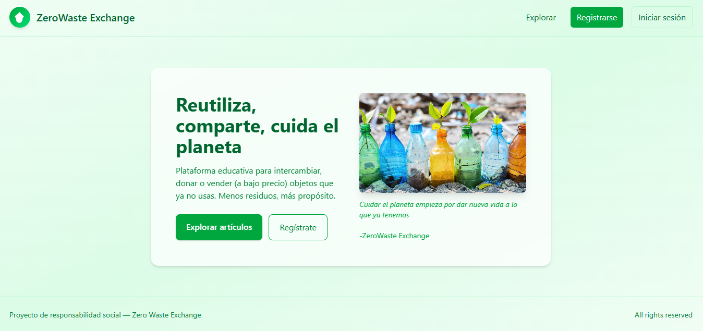
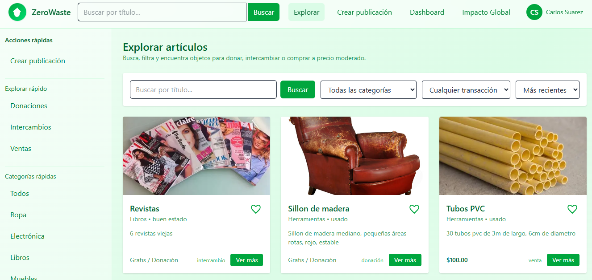
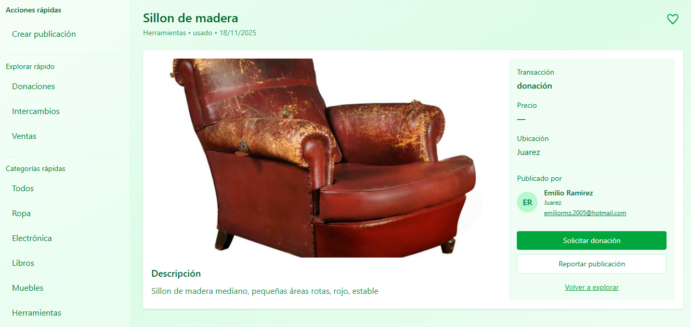
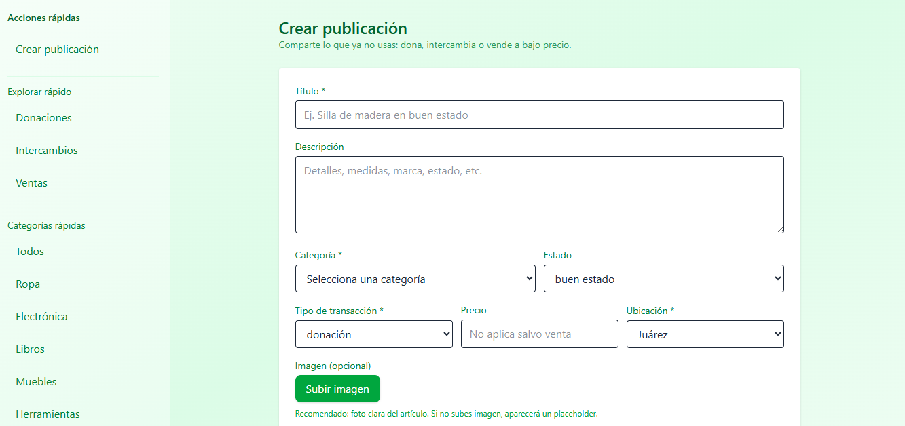
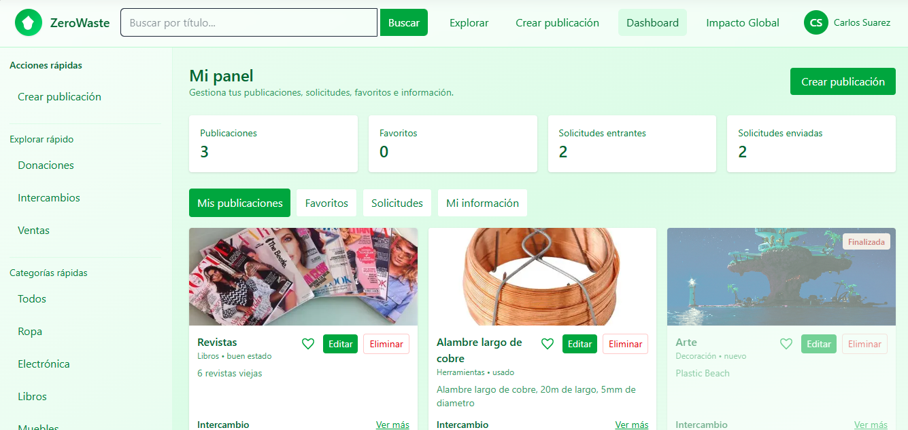
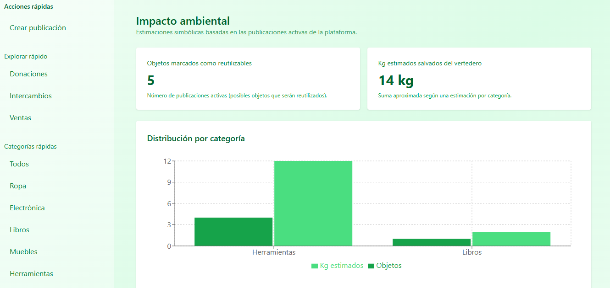
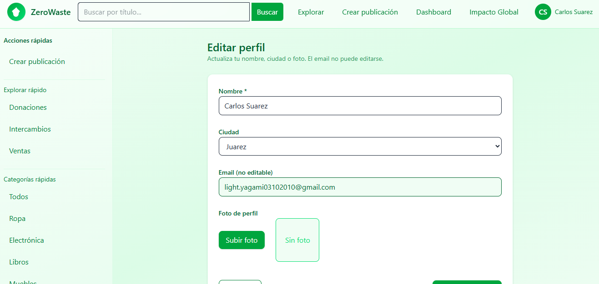
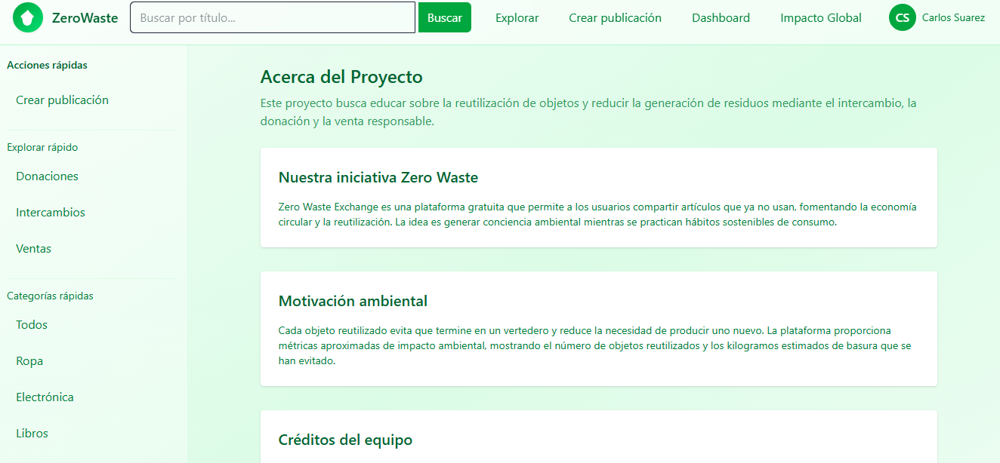

## ZeroWaste Exchange

ZeroWaste Exchange es una aplicación web tipo marketplace donde los usuarios pueden **vender (a precio bajo), intercambiar o donar artículos enfocados en el reciclaje o reutilización con fines de responsabilidad social** mediante anuncios clasificados.
El sistema incluye un backend en Node.js/Express con MongoDB y un frontend en React (Vite).

"Esta plataforma nace para resolver un problema real que los marketplaces tradicionales no atienden: la enorme cantidad de objetos y materiales que podrían reutilizarse —desde muebles y ropa hasta materiales reciclables como alambres, botellas en masa, tubos de PVC u otros insumos— pero que simplemente no encuentran un espacio adecuado porque las tiendas en línea clásicas están construidas para otro propósito y para otro tipo de audiencia. Ese público busca productos nuevos, comerciales, con alta calidad y presentación impecable; en ese ecosistema, los artículos destinados al reciclaje o reuso no encajan, se pierden entre miles de anuncios o directamente se consideran “basura”. Por eso vender o colocar este tipo de objetos en plataformas convencionales es frustrante e ineficiente. En cambio, nuestra plataforma está diseñada justamente para el público que quiere reutilizar, reparar, reciclar o darle una segunda vida a las cosas. Aquí la utilidad importa más que la estética, la segunda vida más que lo nuevo, y el ahorro más que la perfección."

## Características principales

- Exploración de artículos
- Búsqueda por texto flexible mediante el parámetro q.
- Filtros por categoría (category) y tipo de transacción (transactionType).
- Paginación mediante page y limit.
- Ordenamiento por fecha de creación (sort=newest o sort=oldest).
- Por defecto, solo se muestran artículos activos (active = true).
- Publicaciones activas e inactivas
- Los dueños pueden activar o desactivar sus artículos.
- El dashboard del usuario permite obtener artículos propios, incluyendo inactivos
- El backend valida el acceso para asegurar que solo el dueño pueda ver sus artículos inactivos.
- Sistema de usuarios
- Cada publicación pertenece a un usuario registrado.
- La información visible del dueño del artículo incluye: nombre, ciudad, correo y foto.
- CRUD de artículos
- Crear artículos
- Editar artículos
- Activar/desactivar artículos
- Consultar artículos propios y públicos

## Tecnologías utilizadas

**Frontend**

- React con Vite
- React Router
- Axios
- TailwindCSS 
- Context API / Hooks

**Backend**

- Node.js con Express
- MongoDB y Mongoose
- Control de autenticación (JWT)

## SCREENSHOTS

